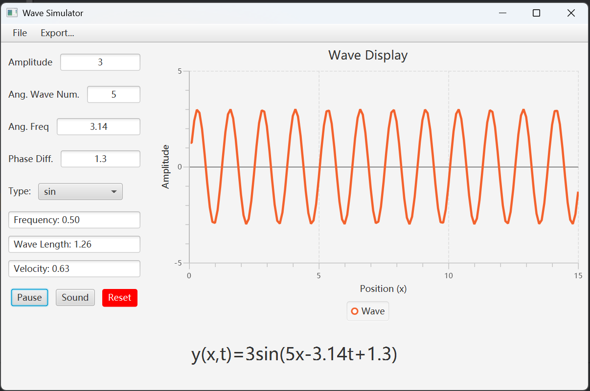
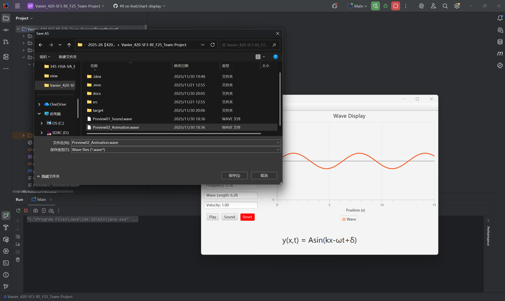
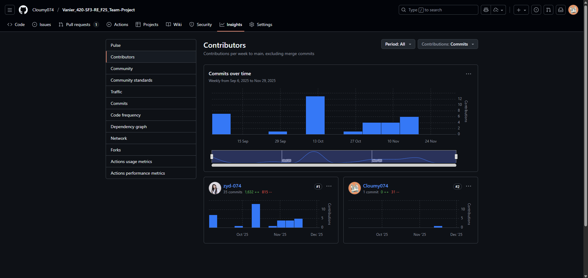

# Changes made to the proposal
1. Added the traveling wave equation (`Acos(kx - wt + \delta)`) to the brief description of the application, and added one mathematical relationship (the one for wavelength).
2. Added a `reset` button to the sample interface
3. Modified the cover page such that course name and title starts, then follows the project name and details

# Snapshot of application: 
Runtime:

Save As File chooser

Most of the demos requires the application under running status.

# GitHub Repo: 
https://github.com/Cloumy074/Vanier_420-SF3-RE_F25_Team-Project.git

# Trello Board: 
https://trello.com/b/QBSKjbH8/project

# Contribution Screenshot: 

(Please note that both accounts correspond to Yu Duo Zhang)

# Testing:
JUnit testing was at first assigned to Yixin Liu, later unfortunately got moved to the backlog due to the work overload. 

So the JUnit testing in this project got simplified a lot, is only testing the calculation methods of frequency, wavelength, speed, and the getYPos() Methods since it's part of the core.
